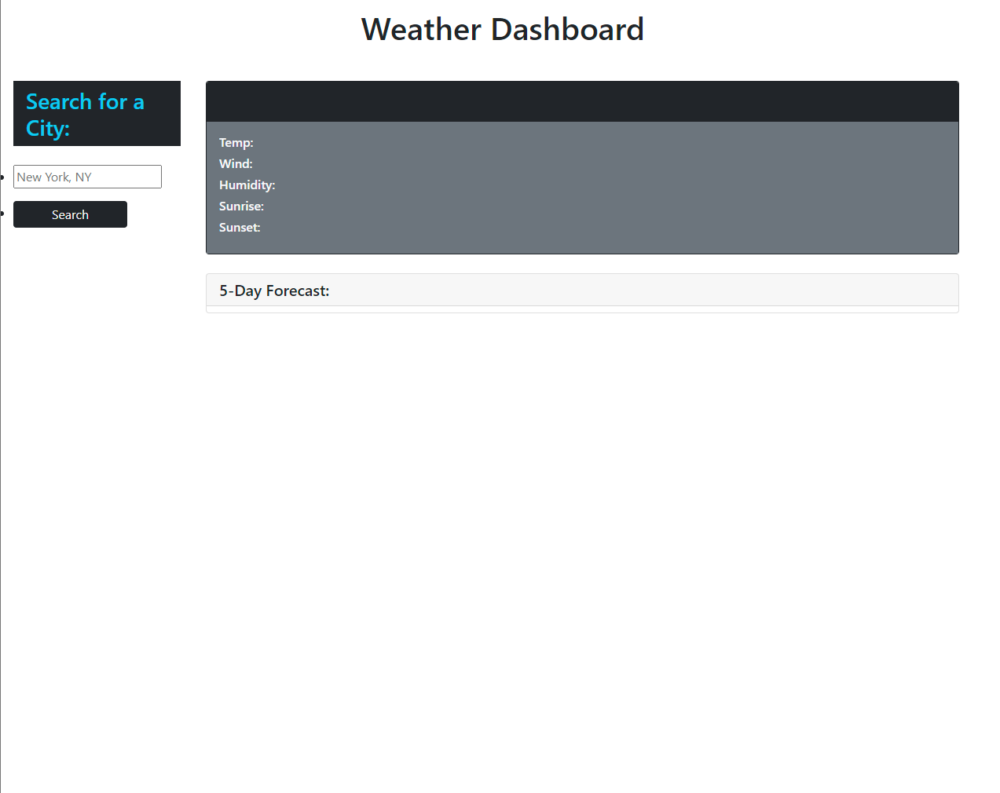

# <My-Password-Generator>

## Description

  Here is a project I'm working on to get the weather from any place you want. The plan for this 
project was to get use to using API keys but they can be tricky. That was one of the issues ive been working on.
While working I've been trying to get the localStorage to log but still having issues with it.

## Installation

<link href="https://cdn.jsdelivr.net/npm/bootstrap@5.1.3/dist/css/bootstrap.min.css" rel="stylesheet"
    integrity="sha384-1BmE4kWBq78iYhFldvKuhfTAU6auU8tT94WrHftjDbrCEXSU1oBoqyl2QvZ6jIW3" crossorigin="anonymous" />

  

## Usage

Basic weather site for looking up the weather. Once it is completed you will be able to search for 
any city you want and it will pull the lon and lat of the location to reference the openweather API
and get the current weather.

## Credits

N/A

## Links

[Git Hub](https://github.com/HaydenLenca/My-Weather-Dashboard)

[Deployed Site]()

## License

Please refer to the LICENSE in the repo.

